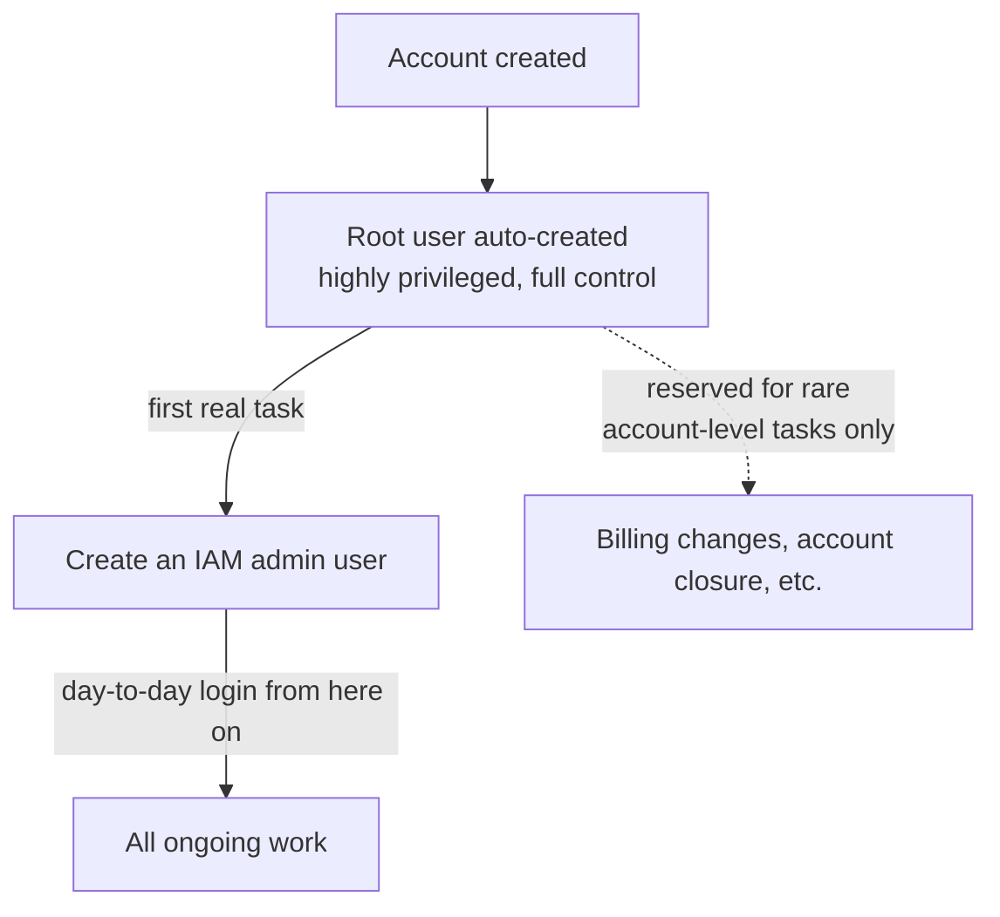

# AWS Accounts: Root User, Creation, and Initial Hardening

> Difficulty: Beginner
> Importance: Critical

`CORE`

## 1. What an AWS Account Actually Is

`CORE`

**Instructor Concept, exact framing**: creating an AWS account needs three things — a credit card (for billing), a unique email address (unique *per account*, since one email can't own two accounts directly), and some name/address details.

**Deeper Explanation, the account as a boundary**: everything you create — identities, resources, billing — lives inside the account, and by default **the account is both a security boundary and a resource boundary**. Resources in different accounts can't see or reach each other unless something explicit is set up to bridge them (this is the entire subject of [IAM Roles](../04-iam-roles/) and [Organizations](../03-organizations/aws-organizations.md) later). Anything chargeable that you launch bills to the card on file for *that* account.

## 2. The Root User

`CORE` `IMPORTANT`

**Instructor Concept, exact definition**: when you create an AWS account, exactly one user is created automatically — the **root user**. It signs in with the email address used to create the account, plus the password you set at creation. The root user is **highly privileged**: full control, can do anything within the account, with no restrictions of any kind.

**Instructor Concept, exact best practice, stated directly**: "it is an IAM best practice that you create individual user accounts and use those to log in" — one of the very first things done after account creation is creating your own IAM user, granting it administrative permissions, and then **avoiding the root user from that point on** precisely because of how privileged it is. The root user isn't disabled or deleted — it's kept for the narrow set of tasks that genuinely require it (some account-level and billing settings, closing the account) and otherwise left alone.

## 3. Two Ways to Authenticate

`IMPORTANT`

**Instructor Concept, exact distinction**:

| Method | Used For | Credential |
|---|---|---|
| **AWS Management Console** | Interactive, browser-based use | Username + password |
| **API / CLI** | Programmatic, scripted use | **Access keys** (an access key ID + secret access key pair) — a different credential type from a console password |

Once authenticated as a principal (root user, or later an IAM user/role), you're **authorized** to do whatever the policies attached to you actually allow — authentication (proving who you are) and authorization (what you're allowed to do) are two separate steps, a distinction this course returns to repeatedly starting in [How IAM Works](../01-iam-fundamentals/how-iam-works.md).

## 4. Hands-On: Creating the Account

`HANDS-ON LAB`

**Instructor Concept, exact prerequisites checklist before starting signup**:

1. A credit/debit card.
2. A unique email address. **Instructor Concept, exact trick for reusing one mailbox across multiple AWS accounts**: Gmail and (newer) Office 365 support **dynamic aliases** — appending `+something` to the local part of an address (e.g., `john+dctmanagement@example.com`) still delivers to the base mailbox (`john@example.com`), while AWS treats it as a distinct, unique email address. This lets one real mailbox "own" many AWS accounts (e.g., a management account, a production account, a sandbox account), each with its own alias.
3. An account name (doesn't need to be globally unique, but you'll separately set an **account alias** that does).
4. A phone number that can receive an SMS or voice call, for identity verification during signup.

**Steps, summarized from the demo**:

1. Go to the AWS sign-up page and choose to create a free-tier account.
2. Supply email, password, and an account name; choose account type (Personal in the demo).
3. Enter contact details, then credit/debit card details for billing.
4. Verify identity via SMS or voice call to the phone number provided.
5. Choose a support plan — the **Basic (free)** plan is sufficient; Developer and Business plans cost money.
6. Sign in as the root user, using the email address and password from step 2.

**Instructor Concept, exact naming convention rationale**: the instructor deliberately calls their first account the **"management account"** — because later, when [AWS Organizations](../03-organizations/aws-organizations.md) is introduced, this first account becomes the organization's management account (the one that creates and governs additional member accounts), and it's also where the primary IAM identities (users, groups, roles) get created. Naming it accordingly from the start avoids confusion later.

**Instructor Concept, exact free-tier scope example**: 750 hours/month of EC2 `t2.micro`/`t3.micro`, 5 GB of S3 storage, and more — a meaningful amount of usage available genuinely free, alongside "always free" tiers for some services and time-limited trials for others.

## 5. Hands-On: Initial Account Configuration

`HANDS-ON LAB`

Once signed in as root, before creating any IAM users, a short list of account-level settings is worth configuring immediately:

1. **Set an account alias** (IAM console, top right). **Instructor Concept, exact reasoning**: the default IAM sign-in URL embeds the numeric account ID (hard to remember); a chosen alias (must be globally unique across all of AWS) replaces it with something memorable — this is the URL IAM users will actually use to sign in.
2. **Enable "IAM user and role access to billing information"** (Account settings page). **Instructor Concept, exact reasoning**: without this, only the root user can view billing — a real friction point once you've stopped using root day-to-day. Enabling it lets billing access be granted through ordinary IAM permissions instead.
3. **Enable billing alert preferences** — "receive AWS Free Tier alerts" and "receive CloudWatch billing alerts," with an email address supplied — this is what actually delivers the free-tier-usage and spend-threshold notifications described below.
4. **Enable PDF invoices by email**, purely a convenience so invoices land in your inbox instead of requiring a console visit to look up.

## 6. Hands-On: Setting a Budget Alarm

`HANDS-ON LAB` `💰 COST NOTE`

**Instructor Concept, exact reasoning**: even while staying disciplined about shutting down and terminating resources after each lab, a budget alarm is cheap insurance against the one thing you forget to clean up.

**Steps**: in the **AWS Budgets** service, create a budget from a template — either a **zero-spend budget** (maximally cost-sensitive) or a **monthly cost budget** with a small dollar threshold (the instructor's example: $5/month). AWS Budgets sends alert emails at **two points**: when forecast/actual spend reaches **85%** of the threshold, and again at **100%**.

**Instructor Concept, exact real-world costs to expect even while "staying in free tier"**: a Route 53 hosted zone runs under $1/month; small miscellaneous charges of a couple of dollars occasionally appear; and **domain registration** (if a lab ever calls for it) typically runs $5–6, which alone can exceed a very tight budget threshold — worth anticipating rather than being surprised by.

**Instructor Concept, exact Cost Explorer note**: Cost Explorer won't show any data for a brand-new account — it needs roughly 24 hours after first being opened before an itemized spend breakdown becomes available.

## 7. Hands-On: Installing the CLI and an Editor

`HANDS-ON LAB`

Two tools are used throughout the hands-on labs in this course:

- **AWS CLI (v2)** — install per your OS from AWS's official CLI documentation (Linux/macOS/Windows each have distinct instructions). Configuring it to actually authenticate (via access keys) is covered once [IAM users exist](../01-iam-fundamentals/how-iam-works.md) — installation alone doesn't grant any access yet.
- **Visual Studio Code** — a general-purpose code editor used for viewing/editing any code or policy JSON supplied alongside the course.

## 8. Common Misconfigurations

`IMPORTANT`

- Continuing to use the root user for day-to-day work instead of switching to an IAM admin user immediately after account creation.
- Never enabling IAM billing access, forcing every billing question back to a root-user login unnecessarily.
- Skipping the budget alarm and discovering a forgotten resource weeks later via the bill instead of an email alert.
- Assuming "free tier" is an absolute spending cap rather than a usage allowance — specific actions (domain registration, hosted zones, certain instance sizes) bill immediately regardless of overall free-tier status.

## Related Topics

- [Course Overview and Practice Options](course-overview-and-practice-options.md)
- [How IAM Works](../01-iam-fundamentals/how-iam-works.md)
- [AWS Organizations](../03-organizations/aws-organizations.md)

## Try This

> Create your own free-tier account if you haven't already, immediately set an account alias and a budget alarm, and confirm you can see the billing alert opt-in checked before you create your first IAM user in the next module.

## Progress

- [ ] I can explain why the root user should be set aside after initial setup rather than used day-to-day
- [ ] I can distinguish console authentication (username/password) from API/CLI authentication (access keys)
- [ ] I've set an account alias, enabled IAM billing access, and created a budget alarm in my own account
