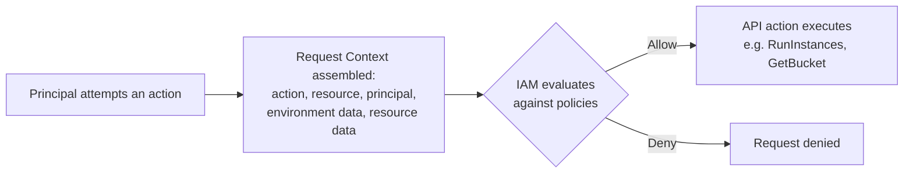

# How IAM Works: Authentication, Authorization, and the Request Context

> Difficulty: Beginner–Intermediate
> Importance: Critical

`CORE`

## 1. Authentication vs. Authorization — Two Separate Steps

`CORE`

**Instructor Concept, exact framing**: every attempt to access AWS goes through two distinct steps handled by IAM. First, **authentication** — proving who you are, via the console (username/password), the CLI, or the API (both programmatic, using access keys). Second, **authorization** — once authenticated, IAM decides whether you're actually *allowed* to perform the specific action you're attempting.

**Instructor Concept, exact rule**: "all principals must be authenticated to send requests" — with narrow, explicit exceptions (the instructor's example: an S3 bucket can be deliberately configured to allow **anonymous** access). Absent such an explicit exception, there is no unauthenticated path to an AWS resource.

## 2. What Counts as a Principal

`CORE`

**Instructor Concept, exact definition**: "a principal is a person or an application that can make a request for an action or operation against an AWS resource." Concrete examples given: a **user**, a **role**, a **federated user** (an identity originating from an external source — Facebook, Google, Amazon — rather than being created natively in IAM), and an **application** authenticating via a user's access key or via a role.

**Deeper Explanation**: this deliberately broad definition is why the rest of this repository can treat "who is asking" uniformly — whether it's a human logging into the console, a script running on a schedule, or an EC2 instance's own application, IAM's authorization logic works the same way once a principal has been established.

## 3. The Request Context

`CORE` `IMPORTANT`

**Instructor Concept, exact mechanism**: whenever a principal attempts an action, AWS assembles a **request context** — a bundle of information IAM evaluates to decide allow or deny. It contains:

- **The action/operation** being attempted (e.g., `RunInstances`, `GetObject`, `CreateUser`).
- **The resource** being targeted.
- **The principal** making the request.
- **Environment data** — e.g., the source IP address.
- **Resource data** — information associated with the resource itself.

**Deeper Explanation, why environment/resource data matters**: this is what makes conditional policy logic possible later in this course — a policy can reference *where* a request came from (source IP) or attributes of the resource itself, not just *who* is asking and *what* they're asking for. The request context is the raw material every policy condition ultimately evaluates against.

## 4. Two Policy Types That Decide the Outcome

`CORE` `EXAM FOCUS`

| Policy Type | Applies To | Example |
|---|---|---|
| **Identity-based policy** | Users, groups, and roles | A policy attached to a user granting S3 read access |
| **Resource-based policy** | The AWS resource itself | An S3 bucket policy, applied directly to the bucket |

**Instructor Concept, exact result of an allowed request**: if the request is authorized, "the API action you're running will be executed against the resource" — concrete examples given: `RunInstances` on EC2, `GetBucket` on S3, `CreateUser` on IAM. This file introduces the two policy types at a high level; the full mechanics of how they combine and evaluate together (including when a resource-based policy alone can grant access with zero identity-side permission) is covered in [Identity-Based and Resource-Based Policies](../02-access-control/identity-vs-resource-policies.md) and [IAM Policy Evaluation](../02-access-control/policy-evaluation.md).

## 5. Common Misconfigurations

`IMPORTANT`

- Assuming every AWS resource requires authentication by default — most do, but explicit exceptions (like a deliberately public S3 bucket) exist and are a real, common source of accidental exposure when configured unintentionally rather than deliberately.
- Conflating authentication and authorization — successfully logging in (authentication) says nothing about what you're then permitted to do (authorization); these are evaluated completely separately.

## Related Topics

- [Users, Groups, Roles, and Policies](users-groups-roles-policies.md)
- [Identity-Based and Resource-Based Policies](../02-access-control/identity-vs-resource-policies.md)
- [IAM Policy Evaluation](../02-access-control/policy-evaluation.md)

## Try This

> In your own account, open the IAM console and view the JSON of any existing policy (even the AWS-managed `AdministratorAccess` policy). Identify the action, resource, and effect fields — these are exactly the pieces of the request context this file describes being evaluated against.

## Progress

- [ ] I can explain the difference between authentication and authorization in my own words
- [ ] I can list what goes into a request context
- [ ] I can name the two policy types and which each one attaches to
