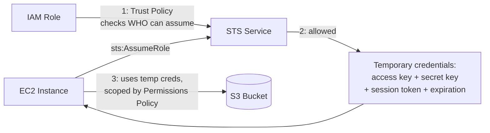

# AWS Security Token Service (STS)

> Difficulty: Intermediate
> Importance: Critical

`CORE`

## 1. Why Does This Exist?

`CORE`

**Instructor Concept, exact framing**: STS is "the service that provides what are known as short-lived or temporary credentials." Its core use case, walked through step by step: an EC2 instance runs an application that needs to read/write files in an S3 bucket. The application has no user account and no password — so how does it get authorized to touch S3 at all?

## 2. The Mechanism, Step by Step

`CORE` `IMPORTANT`

**Instructor Concept, exact walkthrough**:

1. Create an **instance profile** and attach an **IAM role** to it (mechanics covered fully in [IAM Roles](../04-iam-roles/iam-roles.md)).
2. The EC2 instance attempts to **assume the role** via the `sts:AssumeRole` API call.
3. The role has **two separate policies** attached to it, and this distinction matters:
   - A **trust policy** — controls *who/what is allowed to assume the role in the first place*. **Instructor Concept, exact example**: a trust policy allowing the principal `ec2.amazonaws.com` to call `sts:AssumeRole` — meaning "the EC2 service is permitted to assume this role," not any arbitrary caller.
   - A **permissions policy** — defines what the role, once assumed, is actually allowed to *do* (e.g., read/write to a specific S3 bucket).
4. If the trust policy allows it, **STS issues temporary security credentials** to the EC2 instance.
5. The EC2 instance uses those temporary credentials to access S3.

**Exam/Real-World Note, the trust-policy vs. permissions-policy distinction**: a role effectively answers two independent questions — "**who is allowed to become me**" (trust policy) and "**what am I allowed to do once I'm assumed**" (permissions policy). Confusing the two is a common source of "why can't this principal assume the role" vs. "why can't this role do X" debugging confusion — they're separate policy documents controlling separate things.

## 3. What Temporary Credentials Actually Contain

`IMPORTANT`

**Instructor Concept, exact composition**: temporary credentials include an **access key ID**, a **secret access key**, an **expiration**, and a **session token** — the session token is the piece a standard, permanent user access key never has, and it's what marks the credential set as temporary/STS-issued rather than a standing user key. **Instructor Concept, exact lifecycle detail**: these credentials expire after a short period and are **automatically renewed** via STS before they run out — the application/instance doesn't need to manually re-authenticate on a schedule; the renewal is handled transparently.

## 4. Where STS Shows Up Throughout This Course

`CORE`

**Instructor Concept, exact list of situations using temporary credentials**: **identity federation**, **delegation**, **cross-account access**, and **IAM roles generally**. This is a direct preview of later material — [Identity Federation](../05-directory-services-and-federation/identity-federation.md), cross-account roles in [IAM Roles](../04-iam-roles/iam-roles.md), and [IAM Identity Center](../05-directory-services-and-federation/iam-identity-center.md) are all, mechanically, different front doors that all end in the same place: STS issuing temporary credentials scoped by a role's permissions policy.

**Deeper Explanation, why this matters as a mental model**: once you recognize that federation, cross-account access, and EC2/Lambda service roles are all "some external or delegated identity assumes a role and gets temporary STS credentials," the seemingly separate topics later in this course (Directory Services, Identity Center, Cognito) stop being new mechanisms to memorize individually and become variations on one mechanism you already understand.

## 5. Common Misconfigurations

`IMPORTANT`

- Writing an overly broad trust policy (e.g., trusting a wildcard principal) so that far more entities can assume a role than intended — the trust policy is itself a security boundary, not a formality.
- Confusing a role's trust policy with its permissions policy when troubleshooting an assume-role failure versus an access-denied failure once already assumed — these are different documents, different failure modes.
- Assuming temporary credentials need manual refresh logic in application code — STS/SDK tooling handles renewal automatically in the standard patterns this course uses.

## Related Topics

- [Users, Groups, Roles, and Policies](users-groups-roles-policies.md)
- [IAM Roles](../04-iam-roles/iam-roles.md)
- [Identity Federation](../05-directory-services-and-federation/identity-federation.md)
- [IAM Identity Center](../05-directory-services-and-federation/iam-identity-center.md)

## Try This

> After completing the EC2 instance profile lab in [IAM Roles](../04-iam-roles/iam-roles.md), SSH/Session-Manager into the instance and run `curl` against the instance metadata service's security-credentials path to see the actual temporary access key, secret key, session token, and expiration STS issued — the exact four fields described in this file, made concrete.

## Progress

- [ ] I can explain, step by step, how an EC2 instance ends up with temporary credentials to access S3
- [ ] I can distinguish a role's trust policy from its permissions policy and what each one governs
- [ ] I can list the four things a set of temporary STS credentials contains, and what's different about them versus a permanent access key
- [ ] I can name at least three other course topics that are, mechanically, built on this same STS pattern
