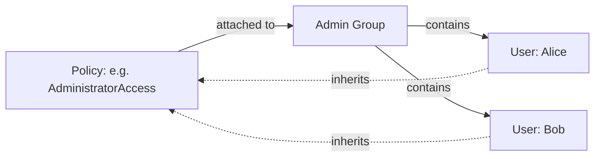
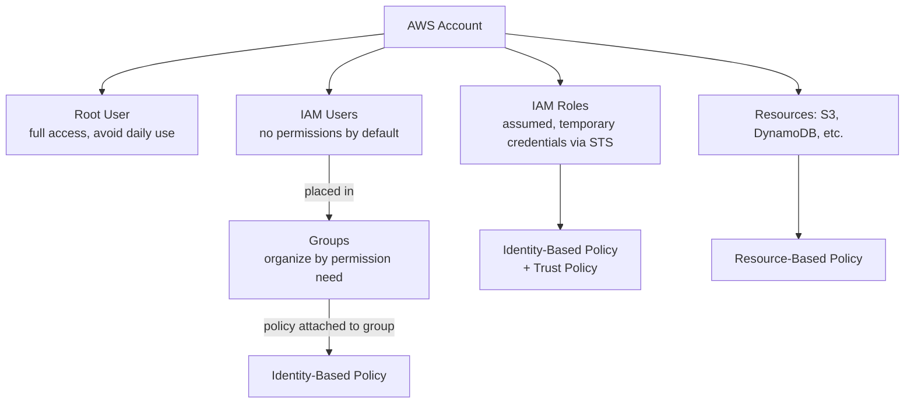

# Users, Groups, Roles, and Policies

> Difficulty: Beginner
> Importance: Critical

`CORE`

## 1. The Root User, Revisited

**Instructor Concept, exact reminder**: the root user is created automatically at account signup, uses the account's signup email, and has **full, unrestricted permissions**. Two best practices apply to it specifically: **avoid using it** for day-to-day work, and **enable MFA** on it (covered in [MFA and Account Security](mfa-and-account-security.md)) — since it can never be permission-restricted the way an ordinary IAM user can.

## 2. Users

`CORE`

**Instructor Concept, exact facts**: an AWS account can hold up to **5,000 individual IAM users**. A newly created user has **no permissions by default** — it can log in (if console access is configured) but can't perform any action until a policy explicitly grants one. Every user has two names:

- A **friendly name** — whatever you name the account (e.g., `Neal`).
- An **ARN (Amazon Resource Name)** — the globally unique identifier, embedding the **account ID**, that distinguishes this exact identity from any similarly-named identity in any other AWS account. **Instructor Concept, exact example**: two different AWS accounts could each have a user named `Andrea` — their ARNs would still be entirely distinct because the account ID segment differs.

Users authenticate via the console (username + password) or programmatically via the CLI/API (access keys) — see [Authentication Methods](authentication-methods.md).

## 3. Groups

`CORE`

**Instructor Concept, exact definition**: "a group is basically a container into which you can place your users." Groups exist for exactly one reason: to **organize users by how you want to apply permissions to them** — mirroring your actual team/department structure (the instructor's example: separate Admin, Development, and Operations groups). A user can belong to **up to 10 groups** at once.

**Instructor Concept, exact mechanism**: you attach a policy to the *group*, not to each user individually — every user placed in that group inherits whatever permissions the group's attached policy grants. **Deeper Explanation**: this is the entire operational payoff of groups — adding a new hire to the "Developers" group instantly grants them the same permission set every other developer already has, and removing them from the group instantly revokes it, without ever touching an individual policy attachment per person.

## 4. Roles

`CORE` `IMPORTANT`

**Instructor Concept, exact definition**: "a role is an identity that has specific permissions assigned to it, and it's **assumed** by users, applications, and services" — the entity assuming it then acts *as if it were the role*, temporarily taking on that role's permissions rather than having permissions of its own.

**Instructor Concept, exact mechanism**: assumption happens via the `sts:AssumeRole` API action (for a user) or an equivalent mechanism for a federated/mobile application. Once assumed, the resulting access is **short-term** — backed by the **Security Token Service (STS)**, which issues temporary credentials that automatically expire and get renewed rather than persisting indefinitely. Roles also work **across AWS accounts** — a user in Account A can be granted the ability to assume a role that exists in Account B, then act as that role against Account B's resources. This cross-account pattern, and the STS mechanics behind it, are covered in full in [AWS Security Token Service (STS)](sts.md) and [IAM Roles](../04-iam-roles/iam-roles.md).

**Deeper Explanation, why this differs fundamentally from a user**: a user has *standing* credentials (a password, or long-lived access keys) that exist until explicitly revoked. A role has no credentials of its own at rest — it only produces temporary credentials at the moment something assumes it, and those credentials self-expire. This is why roles, not long-lived user access keys, are the preferred mechanism for granting access to applications, other AWS services, and other accounts throughout this course.

## 5. Policies

`CORE`

**Instructor Concept, exact definition**: policies are **JSON documents** that define permissions — "the way that you apply permissions." Two types, matching [How IAM Works §4](how-iam-works.md#4-two-policy-types-that-decide-the-outcome):

- **Identity-based policy** — attached to users, groups, or roles.
- **Resource-based policy** — attached directly to a resource (the instructor's examples: an S3 bucket policy, a DynamoDB table policy).

**Instructor Concept, exact default-deny rule, stated explicitly**: "all permissions are implicitly denied by default... everything is denied and we then have to write statements in JSON to allow access to specific actions." A brand-new user or role starts with zero capability — every single permission it ever has was explicitly granted by a policy statement somewhere.

## 6. Putting It Together

## 7. Common Misconfigurations

`IMPORTANT`

- Attaching policies directly to individual users instead of to a group, losing the organizational benefit groups exist to provide and making permission audits harder at scale.
- Assuming a newly created user has any default access — it has none until a policy is attached, directly or via group membership.
- Using long-lived user access keys for an application that could instead assume a role — missing the automatic credential expiration/renewal that makes roles structurally safer.

## Related Topics

- [How IAM Works](how-iam-works.md)
- [Authentication Methods](authentication-methods.md)
- [AWS Security Token Service (STS)](sts.md)
- [IAM Roles](../04-iam-roles/iam-roles.md)

## Try This

> In your own account, create a group, attach a read-only AWS-managed policy to it (e.g., `ViewOnlyAccess`), then create a user and add them to that group. Confirm in the user's summary page that the permission shows as inherited from the group, not attached directly.

## Progress

- [ ] I can explain why groups exist and what problem they solve that individual policy attachment doesn't
- [ ] I can explain what it means for a role to be "assumed," and why the resulting credentials are temporary
- [ ] I can state the default-deny rule precisely and what it implies about a freshly created user
