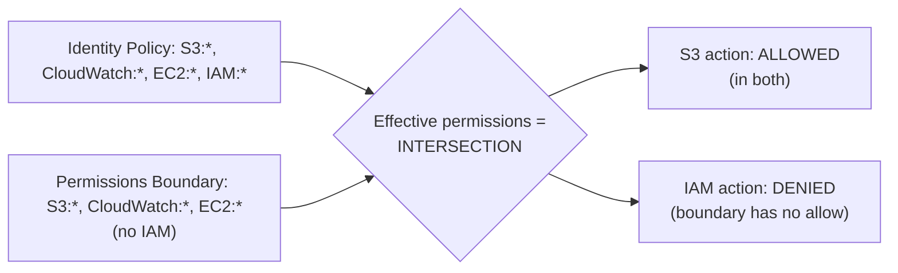

# Permissions Boundaries

> Difficulty: Advanced
> Importance: Critical

`CORE` `EXAM FOCUS`

## 1. Core Concept

`CORE`

**Instructor Concept, exact definition**: a permissions boundary sets **the maximum available permissions** a user or role can ever have — regardless of what any identity-based policy attached to them grants. Critically: **a permissions boundary never grants permissions by itself**; it only ever *restricts* what an already-granted permission can actually do.

**Instructor Concept, exact worked example**: `Joanne` has a developer policy granting full control of S3, CloudWatch, EC2, and IAM. A permissions boundary is also applied, allowing only `s3:*`, `cloudwatch:*`, and `ec2:*` — **IAM is deliberately absent from the boundary**. Result: Joanne can list S3 buckets (both her policy *and* the boundary allow it — she needs **both** to succeed). But when she attempts to create a user in IAM, it's **denied** — even though her identity-based policy grants full IAM access, the boundary doesn't include IAM at all, and the boundary's absence of an allow acts as an implicit deny for anything outside it.

**Exam Note, the precise mental model**: a permissions boundary and an identity-based policy combine via **intersection**, not union — effective permissions are only what **both** allow simultaneously. This is a direct, testable contrast with how an identity-based policy and a resource-based policy combine (union — either one granting access is sufficient), covered in [IAM Policy Evaluation](policy-evaluation.md).

## 2. The Core Use Case: Preventing Privilege Escalation

`CORE` `EXAM FOCUS`

### The Attack, Without a Boundary

**Instructor Concept, exact scenario, framed deliberately as a malicious-insider story**: `Lindsay` has **only** IAM full access — no EC2, no S3, nothing else directly. She cannot launch AWS resources herself. But she *can* use her IAM access to **create a new user** (`X-user`) and attach the **AdministratorAccess** policy to it — then log in as that new user and do "something bad" (the instructor's example: mining cryptocurrency using AWS Batch). **Deeper Explanation**: this is the textbook definition of privilege escalation — Lindsay never had admin permissions directly, but her narrow IAM-only access was sufficient to *create* a fully-privileged identity and use it. IAM permissions to manage other identities are inherently powerful in this specific way, regardless of how narrow they look at first glance.

### The Fix — A Boundary That Travels With Every User Created

**Instructor Concept, exact mechanism, from the hands-on demo's policy file**: a permissions boundary policy is written and attached to Lindsay with four provisions, verified live in the demo:

1. **Allow `iam:*` on all resources** (the baseline — she can use IAM).
2. **Deny altering the permissions boundary policy itself** — she can't edit her own restriction away.
3. **Deny removing the permissions boundary from any user or role** — she can't detach it either.
4. **Deny granting any permission unless the target principal also has this same permissions boundary applied to it** — this is the escalation-blocking clause: **any user Lindsay creates must have the same boundary attached, or the create-user action itself fails outright.**

**Instructor Concept, exact demo confirmation, both without and with the boundary**:

- **Without the boundary**: Lindsay successfully creates `X-user`, attaches `AdministratorAccess`, logs in as `X-user`, and successfully launches an EC2 instance — proving the escalation path is real and exploitable.
- **With the boundary applied to Lindsay**: attempting to create `X-user` **with `AdministratorAccess` but without also selecting the permissions boundary for that new user fails outright** — AWS returns an explicit "not authorized to perform CreateUser" error. Only when Lindsay explicitly also attaches the same permissions boundary to the new user does creation succeed — and logging in as that resulting `X-user` shows it has exactly Lindsay's own effective permissions (IAM only), **not** the `AdministratorAccess` policy's full scope, because the boundary intersects it back down. Attempting to launch EC2 as `X-user` fails with "not authorized," exactly mirroring what Lindsay herself cannot do.

**Deeper Explanation, why provision 4 is the actual escalation blocker**: provisions 2 and 3 stop Lindsay from tampering with *her own* boundary; provision 4 is what stops the *propagation* of escalated privilege to anyone she creates — without it, she could still create a user with more effective permissions than herself, just not by editing her own restrictions directly. The instructor's exact framing: "IAM principals created by IAM admins can't in turn create principals with more permissions than the IAM admins" — the restriction is designed to be self-propagating down every level of delegation, not a single-hop check.

## 3. What a Boundary Is, Structurally

`IMPORTANT`

**Instructor Concept, exact detail**: "a permissions boundary is just another policy, really" — it's created and stored exactly like any other customer-managed policy (Create Policy → JSON), and then applied specifically as a permissions boundary on a user or role at creation/edit time, rather than being a fundamentally different object type.

## 4. Common Misconfigurations

`EXAM FOCUS` `IMPORTANT`

- Writing a permissions boundary that restricts a principal's *own* actions but omits the "created principals must also carry this boundary" clause — leaving the escalation path fully open, just one indirection removed.
- Assuming a permissions boundary grants access on its own — it never does; the identity-based policy must still separately grant whatever the boundary allows.
- Applying a permissions boundary to a user but forgetting it must also be explicitly re-applied to every user that principal subsequently creates — it does not propagate automatically unless the boundary's own policy logic enforces that requirement (as in the worked example above).

## Related Topics

- [Users, Groups, Roles, and Policies](../01-iam-fundamentals/users-groups-roles-policies.md)
- [IAM Policy Evaluation](policy-evaluation.md)
- [RBAC and ABAC](rbac-and-abac.md)

## Try This

> In your own account, recreate the Lindsay scenario end to end: create a user with only `IAMFullAccess`, confirm they can create an admin-level user unrestricted, then apply a permissions-boundary policy (using the four-provision structure above) and confirm the same escalation attempt now fails until the boundary is explicitly propagated to the new user too.

## Progress

- [ ] I can explain why permissions boundaries combine with identity policies via intersection, not union
- [ ] I can walk through the full Lindsay privilege-escalation scenario, both without and with the boundary applied
- [ ] I can identify which specific boundary provision is what actually blocks escalation *propagation*, as opposed to self-modification
