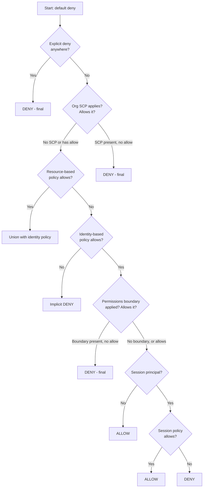

# IAM Policy Evaluation Logic

> Difficulty: Advanced
> Importance: Critical

`CORE` `EXAM FOCUS`

## 1. Every Decision Starts With Deny

`CORE`

**Instructor Concept, exact starting rule**: "every decision starts with a deny... all permissions are not allowed by default, everything is denied." AWS then walks a specific evaluation sequence looking for an allow — and at nearly every stage, an **explicit deny found anywhere immediately ends the evaluation with a final deny**, no matter what's found afterward.

## 2. The Evaluation Sequence, Step by Step

`CORE` `EXAM FOCUS`

**Instructor Concept, exact order, walked through directly from AWS's own evaluation flowchart**:

1. **Explicit deny check** — if any applicable policy explicitly denies the action, the final decision is **deny**, immediately, full stop. Nothing that follows can override this.
2. **Organizations SCP check** — is the account a member of an AWS Organization with an applicable Service Control Policy? If not, skip to the next stage. If so, does the SCP allow the action? No allow in the SCP → final deny. Allow present → continue.
3. **Resource-based policy check** — does the target resource have a resource-based policy (e.g., an S3 bucket policy)? If yes and it allows the action, evaluation proceeds understanding this interacts with identity-based policy (see §3, union rule). If no allow found here, continue to check identity-based policy.
4. **Identity-based policy check** — does an applicable identity-based policy allow the action? If neither the resource-based nor the identity-based policy has an allow, the result is an **implicit deny**. If there is an allow, continue.
5. **Permissions boundary check** — does the principal have a permissions boundary applied? If yes, is the action allowed within the boundary? No → deny. Yes → continue. (See [Permissions Boundaries](permissions-boundaries.md) for the full mechanics.)
6. **Session principal check** — is this a session principal (i.e., a role or federated session, not a standing user)? If no, the result is **allow**. If yes, continue.
7. **Session policy check** — is there a session policy with an allow? If not, deny; if yes, continue.
8. **Role session check** — is this specifically a role session? If yes, allow; if not... (the chain resolves from here based on the specific session type).

## 3. Five Policy Types That Feed This Evaluation

`CORE` `EXAM FOCUS`

| Policy Type | Attached To | Governs |
|---|---|---|
| **Identity-based** | Users, groups, roles | What the identity itself can do |
| **Resource-based** | The resource directly (S3, DynamoDB, etc.) | Who can access this specific resource |
| **Permissions boundary** | Users and roles | The *maximum* permissions an identity-based policy can ever grant that principal |
| **Organizations SCP** | Accounts/OUs within an Organization | The maximum permissions available to every account/OU it applies to |
| **Session policy** | Passed at the moment of `AssumeRole`/federation | Further restricts what a specific temporary session can do |

## 4. How Policy Types Combine — Union vs. Intersection

`EXAM FOCUS` — the single most consistently tested piece of this file

**Instructor Concept, exact combination rules, stated as three distinct cases**:

1. **Identity-based policy + resource-based policy → UNION**. Effective permissions are whatever **either** policy grants. An allow in either is sufficient (subject to the "explicit deny anywhere wins" rule from §1).
2. **Identity-based policy + permissions boundary → INTERSECTION**. Effective permissions are only what's allowed in **both**. See the worked example in [Permissions Boundaries](permissions-boundaries.md#1-core-concept).
3. **Identity-based policy + Organizations SCP → INTERSECTION**. Same logic as permissions boundaries — an SCP sets a ceiling; effective permissions are only what both the SCP and the identity-based policy agree on. See [Service Control Policies](../03-organizations/service-control-policies.md).

**Exam Note**: resource-based policies are the *one* combination that widens effective access (union); permissions boundaries and SCPs are both restriction mechanisms (intersection) — mixing these up is the single easiest mistake to make on this topic, and the exact reason this file exists as a distinct reference from [Permissions Boundaries](permissions-boundaries.md) and [Identity-Based and Resource-Based Policies](identity-vs-resource-policies.md), which each cover one piece individually.

## 5. Five Determination Rules, Stated Directly

`EXAM FOCUS`

**Instructor Concept, exact closing summary, verbatim in substance**:

1. By default, all requests are **implicitly denied** — except the root user, who has full access with no evaluation needed.
2. An **explicit allow** in an identity-based or resource-based policy overrides that default implicit deny.
3. If a permissions boundary, Organizations SCP, or session policy is present, it **can override an allow with an implicit deny** — i.e., these three are ceiling mechanisms that can silently cap an otherwise-granted allow.
4. An **explicit deny in any applicable policy overrides every allow**, no matter where that allow came from.

## 6. Common Misconfigurations

`EXAM FOCUS` `IMPORTANT`

- Assuming an identity-based allow is sufficient on its own, without checking whether an SCP or permissions boundary silently caps it below what the identity policy itself grants.
- Writing a broad allow and a narrow, unintentional deny in two different policies applying to the same principal — not realizing the deny wins regardless of which policy is "more specific" or "more recently written."
- Forgetting that resource-based and identity-based policies combine differently (union) than permissions boundaries/SCPs do (intersection) — leading to incorrect predictions about whether a given request will succeed.

## Related Topics

- [Identity-Based and Resource-Based Policies](identity-vs-resource-policies.md)
- [Permissions Boundaries](permissions-boundaries.md)
- [Service Control Policies](../03-organizations/service-control-policies.md)
- [AWS Security Token Service (STS)](../01-iam-fundamentals/sts.md)

## Try This

> Using the [Policy Tools](policy-tools.md) IAM Policy Simulator in your own account, pick a user with both a permissions boundary and a broad identity-based policy, and simulate an action outside the boundary's scope. Confirm the simulator reports a deny, then explain why using the intersection rule from this file.

## Progress

- [ ] I can walk through the full evaluation sequence from memory, in order
- [ ] I can state which policy-type combinations use union vs. intersection, and why
- [ ] I can state the five determination rules and explain what each one means practically
