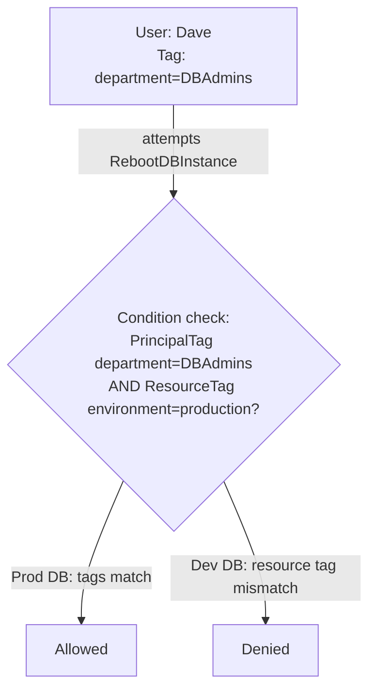

# Access Control Methods: RBAC and ABAC

> Difficulty: Intermediate
> Importance: Critical

`CORE`

## 1. Role-Based Access Control (RBAC)

`CORE`

**Instructor Concept, exact mechanism**: groups act as containers holding users who share a job function (Admin, Development, Operations), and a permissions policy attached to each group gives every member exactly the access their role needs — nothing more. **Instructor Concept, exact framing of the underlying principle**: "it's about minimizing the permissions you assign to users and giving them exactly what they need for their job function" — this is the **principle of least privilege**, and RBAC (via groups) is the mechanism this course uses to implement it in practice.

**Instructor Concept, exact example**: an Operations group member (`Andrea`) and a Development group member (`Lee`) each get the specific permissions their role needs — and explicitly **cannot** do each other's job, because the permission sets are deliberately scoped and non-overlapping.

### AWS-Managed Job Function Policies

`IMPORTANT`

**Instructor Concept, exact detail**: AWS provides a set of pre-built **job function policies** — Administrator, Data Scientist, Security Auditor, System Administrator, Billing, and others — designed to closely match common industry job roles. **Real-World Consideration**: these are directly useful for anyone without deep experience writing IAM policy JSON from scratch — attach the closest-matching job function policy to a group, and it usually covers the role reasonably well without custom authoring.

## 2. Attribute-Based Access Control (ABAC)

`CORE` `EXAM FOCUS`

**Instructor Concept, exact mechanism**: ABAC grants access based on **tags** (metadata key-value pairs) rather than group membership. **Instructor Concept, exact worked example**:

- A user (`Dave`) is tagged with `department = DBAdmins`.
- A permissions policy attached to his group allows `RebootDBInstance`, `StartDBInstance`, and `StopDBInstance` on `Resource: *`, **but only under a condition**: the request context's principal tag (`aws:PrincipalTag/department`) must equal `DBAdmins`, **and** the target resource's tag (`aws:ResourceTag/environment`) must equal `production`.
- Two RDS instances exist: one tagged `environment = production`, one tagged `environment = development`.
- **Result**: Dave can successfully reboot the **production** database (both tag conditions match), but is **denied** when attempting to stop the **development** database (the resource tag doesn't match the condition, so no matching allow exists).

**Deeper Explanation, why ABAC scales differently than RBAC**: with RBAC, adding a new environment (staging, QA) or a new resource dimension typically means creating new groups and new policies. With ABAC, the *same* policy already scales to any number of resources and users — as long as the tags are applied correctly, a new production database automatically falls under Dave's existing permission the moment it's tagged `environment = production`, with zero policy changes required. **Real-World Consideration, exact instructor framing**: "this is a great way of implementing access control as it gives you a lot of flexibility" — the tradeoff is that ABAC's correctness now depends entirely on tagging discipline being consistently enforced across the account.

## 3. RBAC vs. ABAC — When Each Fits

`EXAM FOCUS`

| | RBAC (groups) | ABAC (tags) |
|---|---|---|
| Scales by | Creating new groups/policies per role | Applying tags consistently; policy logic reused |
| Best fit | A relatively stable set of job functions | Many resources/environments where tagging is already, or can be, disciplined |
| Failure mode | Policy sprawl as roles multiply | Silent access gaps/over-grants if tagging is inconsistent |

**Deeper Explanation**: these are not mutually exclusive — a real account commonly uses RBAC (groups by job function) as the primary structure, with ABAC layered in for finer-grained, resource-specific control within a role (exactly as in the Dave/RDS example, where group membership already scoped Dave to database actions, and tags then further scoped *which* databases).

## 4. Common Misconfigurations

`EXAM FOCUS` `IMPORTANT`

- Relying on ABAC without a consistent, enforced tagging strategy — a resource with a missing or incorrect tag silently falls outside every ABAC-conditioned policy's intended scope, either denying legitimate access or (worse) failing to restrict it if the condition logic isn't carefully designed.
- Attaching AWS-managed job function policies without reviewing whether they actually match the organization's real permission needs — they're a starting point, not guaranteed to be exactly right for every use case.
- Building deeply nested or overlapping groups instead of clean, role-aligned ones, undermining the clarity RBAC is supposed to provide.

## Related Topics

- [Users, Groups, Roles, and Policies](../01-iam-fundamentals/users-groups-roles-policies.md)
- [IAM Policy Structure](policy-structure.md)
- [IAM Policy Evaluation](policy-evaluation.md)
- [Permissions Boundaries](permissions-boundaries.md)

## Try This

> In your own account: tag one EC2 instance `environment=production` and another `environment=development`, then write a policy allowing `StopInstances` only where `aws:ResourceTag/environment` equals `development` — attach it to a test user and confirm they can stop the dev instance but not the prod one.

## Progress

- [ ] I can explain the principle of least privilege and how RBAC (via groups) implements it
- [ ] I can walk through the Dave/RDS ABAC example, including exactly which tag comparison determines allow vs. deny
- [ ] I can explain a realistic scenario where RBAC and ABAC would be combined rather than used exclusively
