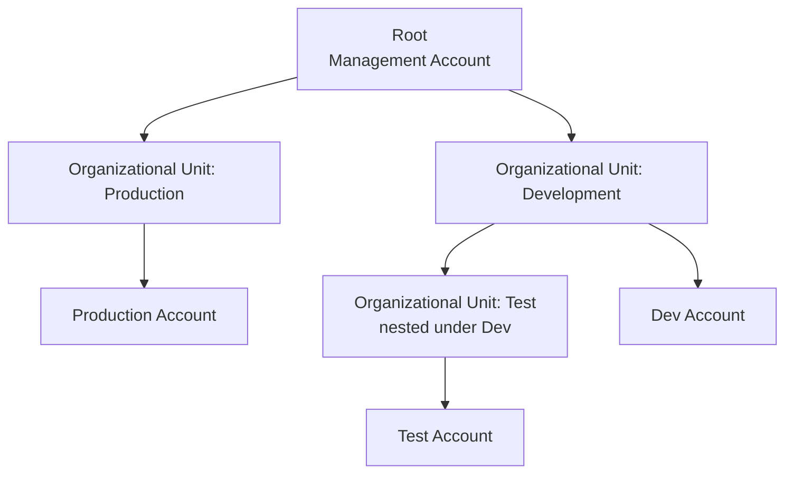

# AWS Organizations

> Difficulty: Intermediate
> Importance: Critical

`CORE`

## 1. Why Does This Exist?

`CORE`

**Instructor Concept, exact framing**: AWS Organizations is "a really useful tool that enables us to centrally manage multiple accounts and apply policies to those accounts" — and, alongside governance, it produces a **single consolidated bill** across every account in the organization.

## 2. Core Structure

`CORE` `IMPORTANT`

**Instructor Concept, exact hierarchy**:

- **Management account** — the account that creates the organization; it forms the **root** of the entire hierarchy. This is the same account named "management" back in [AWS Accounts](../00-getting-started/aws-accounts.md), specifically because of this later role.
- **Member accounts** — created directly through Organizations (programmatically, via the Organizations API, or through the console), or existing accounts invited to join.
- **Organizational Units (OUs)** — containers that group accounts together, forming a hierarchy underneath the root; an OU can hold multiple accounts, and OUs can nest inside other OUs.
- **Service Control Policies (SCPs)** — attached at the root, an OU, or an individual account, controlling the **maximum available API actions** in whatever it's attached to. Covered in full in [Service Control Policies](service-control-policies.md).

## 3. What Organizations Adds on Top of Multiple Accounts

`IMPORTANT`

**Instructor Concept, exact list of centralized capabilities**:

- **Service Control Policies** — govern which API actions are even possible in a given account, independent of what any individual user's IAM permissions allow (full detail in [Service Control Policies](service-control-policies.md)).
- **Tag policies** — standardize tagging rules across resources in member accounts (distinct from SCPs — tag policies enforce tagging *consistency*, not API-action availability).
- **AWS SSO / IAM Identity Center integration** — connecting a single on-premises directory (or other identity source) via SSO gives access across **every account in the organization** at once, not just one account individually. Covered fully in [IAM Identity Center](../05-directory-services-and-federation/iam-identity-center.md).
- **Consolidated billing** — one bill for every account in the organization, centralizing cost management.
- **Organization-wide CloudTrail** — enabling CloudTrail in the management account and applying it to member accounts means every API action taken **anywhere in the organization** is captured centrally, supporting compliance auditing across the whole account structure, not just one account at a time.

## 4. What Happens When Organizations Creates a New Account

`CORE` `EXAM FOCUS`

**Instructor Concept, exact mechanism, and the important default-security caveat**: when Organizations creates a new member account, it automatically provisions a role in that new account called **`OrganizationAccountAccessRole`**, with **full permissions** in the new account. **Instructor Concept, exact default trust configuration**: this role's trust policy is set up so that **any user in the management account holding the `sts:AssumeRole` permission can assume it** — meaning, by default, a broad set of management-account users can gain full administrative access to every account Organizations creates, not just a designated few.

**Exam Note / Real-World Consideration, stated explicitly**: "in a real-world situation, you may very well want to lock down these policies to make sure that only specific users are able to actually assume this role... or you'd want to modify that role and reduce the permissions available." This default is a genuine, common security gap if left unexamined — new accounts should have this role's trust policy tightened (or its own permissions narrowed) deliberately, not left at the wide-open default.

## 5. Common Misconfigurations

`EXAM FOCUS` `IMPORTANT`

- Leaving `OrganizationAccountAccessRole`'s default trust policy unchanged, granting effectively unrestricted admin access across every member account to anyone in the management account with `sts:AssumeRole`.
- Assuming SCPs alone govern security posture and forgetting IAM permissions inside each account still need to be independently correct — SCPs only *cap* what's possible, they never grant anything (see [Service Control Policies](service-control-policies.md)).
- Not enabling organization-wide CloudTrail, leaving blind spots in individual member accounts' audit trails.

## Related Topics

- [AWS Accounts](../00-getting-started/aws-accounts.md)
- [Service Control Policies](service-control-policies.md)
- [IAM Identity Center](../05-directory-services-and-federation/iam-identity-center.md)
- [IAM Roles](../04-iam-roles/iam-roles.md)

## Try This

> In your own management account, create an Organization, add or create a second account, and inspect the auto-created `OrganizationAccountAccessRole`'s trust policy — confirm exactly which principals are currently allowed to assume it, and consider whether that scope is appropriate before doing anything further with the account.

## Progress

- [ ] I can name the core Organizations hierarchy elements (management account, member accounts, OUs, SCPs)
- [ ] I can list what Organizations centralizes beyond just holding multiple accounts
- [ ] I can explain the default trust configuration of `OrganizationAccountAccessRole` and why it's a real security consideration, not just a technical detail
