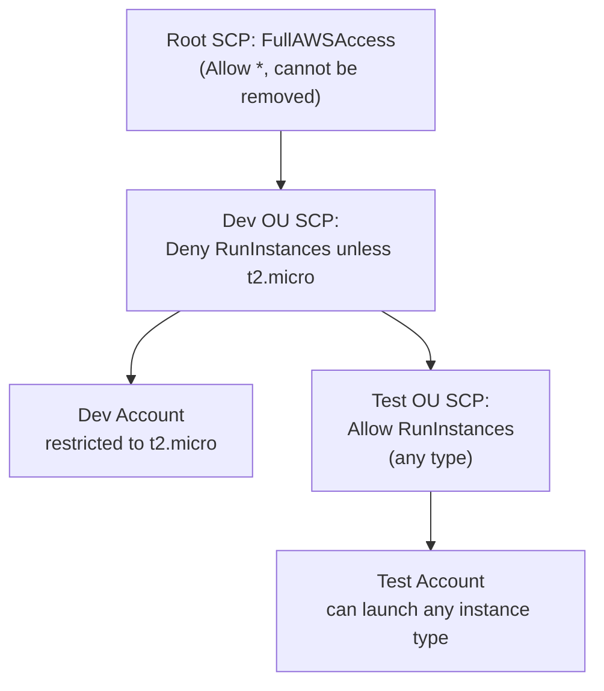

# Service Control Policies (SCPs)

> Difficulty: Advanced
> Importance: Critical

`CORE` `EXAM FOCUS`

## 1. The One Rule to Internalize First

`CORE`

**Instructor Concept, exact rule, repeated for emphasis in the source material**: "SCPs do not grant any permissions, they control the available permissions." An SCP allowing `EC2:RunInstances` doesn't give anyone the ability to launch an EC2 instance by itself — a user still needs an actual IAM identity-based (or resource-based) policy granting that action too. The SCP only determines whether that action is even **possible** in the account at all — it's a ceiling, never a source of permission on its own. This is the exact same intersection relationship as [Permissions Boundaries](../02-access-control/permissions-boundaries.md), applied at the account/OU level instead of the individual-identity level.

## 2. The Default Root Policy

`IMPORTANT`

**Instructor Concept, exact detail**: every Organization starts with a default SCP called **`FullAWSAccess`**, attached at the root — `Effect: Allow`, `Action: *`, `Resource: *`. This policy **cannot be removed**. **Instructor Concept, exact exemption**: users in the **management account are not restricted by SCPs, and cannot be restricted** — SCPs only ever apply to member accounts/OUs beneath the root, never to the management account itself.

## 3. How SCPs Apply Down the Hierarchy

`CORE` `EXAM FOCUS`

**Instructor Concept, exact worked example**:

- A **Dev OU** has an SCP applied: `Effect: Deny`, `Action: EC2:RunInstances`, `Resource: *`, `Condition: { StringNotEquals: { ec2:InstanceType: t2.micro } }`. **Instructor Concept, exact reading**: this denies launching any instance type **except** `t2.micro` — the condition means the deny simply doesn't apply when the instance type *is* `t2.micro`.
- A **Test OU**, nested beneath the Dev OU, has its **own** SCP attached with an explicit allow for `EC2:RunInstances`.
- **Instructor Concept, exact stated result**: accounts in the Test OU can launch *any* EC2 instance type (assuming the users themselves also have the correct IAM permissions), because the more specific, lower-level policy takes precedence for that OU.

**Deeper Explanation, framing this precisely**: an account's *effective* SCP restrictions are the combined effect of every SCP attached anywhere along its path from the root down to itself. The practical lesson demonstrated here is that **OU placement and per-OU SCP attachment directly determine what's possible in an account** — the same account, moved to a different OU, could have an entirely different effective ceiling.

## 4. Hands-On: Restricting EC2 Instance Types

`HANDS-ON LAB` `EXAM FOCUS`

**Steps, summarized from the demo**:

1. Create an OU, move a member (production) account into it.
2. Create a new SCP with the exact policy read through above: `Effect: Deny`, `Action: EC2:RunInstances`, `Resource: *`, `Condition: StringNotEquals ec2:InstanceType t2.micro`.
3. **Attach** the policy to the OU (creating a policy alone does nothing — it must be explicitly attached to a root/OU/account, exactly like [Permissions Boundaries](../02-access-control/permissions-boundaries.md) must be explicitly applied to a principal).
4. Switch into the member account (via the `OrganizationAccountAccessRole` from [AWS Organizations](aws-organizations.md#4-what-happens-when-organizations-creates-a-new-account) — this role has **full account permissions**, deliberately used here to prove the SCP restricts *even a fully-privileged role*).
5. Attempt to launch a `t2.medium` instance → **launch fails**, "not authorized to perform this operation" — confirming the SCP overrides even a role with full IAM permissions in that account.
6. Attempt to launch a `t2.micro` instance → **succeeds** — confirming the condition's exact boundary works as written.

**Exam Note, the core lesson this demo proves**: an SCP restriction applies **regardless of how privileged the IAM identity attempting the action is** — even a role with `Action: *, Resource: *` inside the account cannot bypass an SCP denying that specific action, because SCP evaluation happens at a level above individual account IAM policy entirely (see the evaluation sequence in [IAM Policy Evaluation](../02-access-control/policy-evaluation.md)).

## 5. Hands-On: Preventing S3 Bucket Deletion

`HANDS-ON LAB`

**Steps, summarized from the demo**: create an S3 bucket in the member account (successfully, using the still-unrestricted `OrganizationAccountAccessRole` before this SCP is attached); create a new SCP with `Effect: Deny`, `Action: s3:DeleteBucket`, `Resource: <specific bucket ARN>`; attach it to the same OU; switch back into the member account and attempt to delete the bucket → **insufficient permissions**, blocked. **Deeper Explanation, why this specific example matters**: it demonstrates SCPs scoped to a **specific resource ARN**, not just a wildcard — the same targeting precision available in ordinary IAM policies (see [IAM Policy Structure](../02-access-control/policy-structure.md)) applies equally to SCPs, letting an organization protect one specific critical bucket without blanket-denying `DeleteBucket` account-wide.

## 6. Common Misconfigurations

`EXAM FOCUS` `IMPORTANT`

- Creating an SCP but never attaching it to a root/OU/account, then being confused why nothing changed — an unattached SCP has zero effect.
- Assuming an SCP grants the permission it allows — it never does; the account's own IAM policies must still separately grant it.
- Forgetting SCPs never apply to the management account, and expecting a management-account restriction that structurally cannot exist.
- Placing an account in the wrong OU (or nested OU) and being surprised by an unexpected combination of inherited restrictions.

## Related Topics

- [AWS Organizations](aws-organizations.md)
- [Permissions Boundaries](../02-access-control/permissions-boundaries.md)
- [IAM Policy Evaluation](../02-access-control/policy-evaluation.md)

## Try This

> In your own Organization, create an OU, attach an SCP denying a specific action (e.g., `s3:DeleteBucket` scoped to one test bucket's ARN), move a test account into the OU, and confirm — using the account's own full-access role — that the action is blocked despite that role's otherwise unrestricted IAM permissions.

## Progress

- [ ] I can state precisely why SCPs never grant permissions, only cap them
- [ ] I can explain why the management account is exempt from SCPs
- [ ] I can walk through the Dev/Test OU nested-SCP example and explain why the Test account ends up with different effective permissions than the Dev account
- [ ] I can explain why the EC2 hands-on demo proves SCPs override even a fully-privileged in-account role
