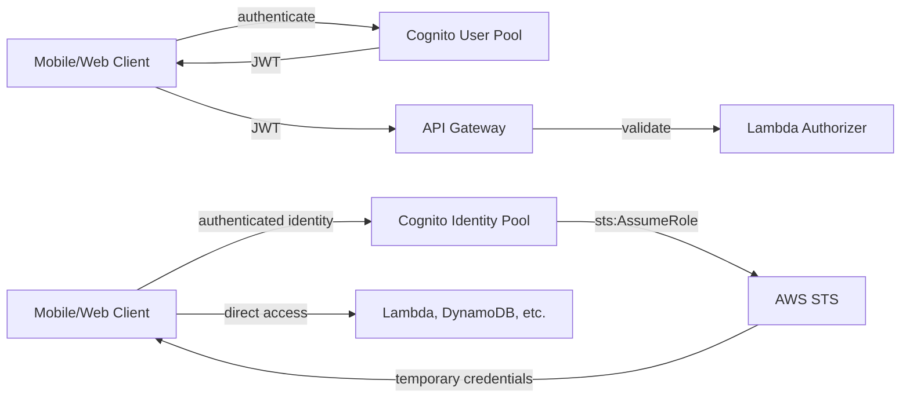

# Amazon Cognito

> Difficulty: Advanced
> Importance: High

`CORE` `EXAM FOCUS`

## 1. What It's For

`CORE`

**Instructor Concept, exact positioning**: Cognito is the identity provider AWS recommends specifically for **web and mobile applications**, providing both **sign-in and sign-up** services. Where [IAM Identity Center](iam-identity-center.md) targets workforce/enterprise SSO and plain [IAM federation](identity-federation.md) targets direct SAML/OIDC integration, Cognito is purpose-built for **customer-facing application** identity — the users of your own app, not your own organization's staff.

## 2. Two Distinct Concepts — User Pools vs. Identity Pools

`CORE` `EXAM FOCUS`

**Instructor Concept, exact acknowledgment of the confusion this causes**: "it's really important to understand the differences between them... probably not the best naming convention, but that's how it works." The naming is genuinely easy to mix up, so the distinction is worth memorizing precisely:

| | User Pool (CUP) | Identity Pool |
|---|---|---|
| **What it actually is** | A directory that manages sign-in/sign-up — **contains the identities themselves** | A mechanism for obtaining **temporary, limited-privilege AWS credentials** — does **not** contain identities |
| **Output** | A **JSON Web Token (JWT)** proving authentication | Temporary AWS credentials, via STS |
| **Identity source it accepts** | The pool itself, or a linked social/SAML/OIDC provider | A Cognito User Pool, a social provider, or a SAML/OIDC provider |

**Instructor Concept, exact one-line summary, worth memorizing verbatim**: "user pools actually contain the identities; identity pools are actually the way that you get the temporary credentials to access AWS services."

## 3. User Pool Flow

`CORE`

**Instructor Concept, exact sequence**, using a mobile client calling an API via Amazon API Gateway:

1. The client authenticates against a **Cognito User Pool**.
2. On success, the pool returns a **JSON Web Token (JWT)**.
3. The client passes the JWT to **API Gateway**.
4. A **Lambda authorizer** validates the JWT and authorizes (or denies) the client's access to the underlying application.

**Deeper Explanation, Cognito's role in this flow**: the instructor describes Cognito here as acting as an **identity broker** between the identity provider (which may be the User Pool itself, or an external social provider federated into it) and AWS — the client never talks to a social provider's own AWS integration directly; Cognito mediates it.

## 4. Identity Pool Flow

`CORE`

**Instructor Concept, exact sequence**, using a scenario needing access to Lambda and DynamoDB:

1. A **Cognito Identity Pool** is configured, with its identity source being either a Cognito User Pool, a social identity, or a SAML/OIDC provider.
2. Once the underlying identity is authenticated (via whichever of those sources), the Identity Pool talks to **STS**, calling **`sts:AssumeRole`**.
3. STS returns **temporary, limited-privilege credentials**.
4. The application uses those credentials to access AWS services directly (Lambda, DynamoDB, or anything else the assumed role's permissions policy allows).

**Deeper Explanation, why this is the same STS pattern one more time**: exactly like `AssumeRoleWithSAML` in [Identity Federation](identity-federation.md) and the EC2 instance-profile flow in [IAM Roles](../04-iam-roles/iam-roles.md), the Identity Pool's job is to get an already-authenticated identity to the point where **STS can issue temporary credentials against a role**. Cognito Identity Pools are not a fundamentally new access mechanism — they're a mobile/web-application-shaped front door onto the same `AssumeRole` machinery this entire course keeps returning to.

## 5. Supported Identity Sources

`IMPORTANT`

**Instructor Concept, exact list**: social providers — **Apple, Facebook, Google, Amazon, Twitter**, and others — alongside SAML/OIDC-based providers, and Cognito User Pools themselves as an identity source. This breadth is exactly why AWS recommends Cognito over configuring Web Identity Federation directly in IAM (per [Identity Federation §4](identity-federation.md#4-iams-identity-provider-configuration)) — Cognito already handles the sign-in/sign-up UX and the multi-provider integration work that a hand-rolled IAM OIDC configuration would leave entirely to you.

## 6. Common Misconfigurations

`EXAM FOCUS` `IMPORTANT`

- Confusing a User Pool with an Identity Pool — expecting a User Pool to hand out AWS credentials (it never does; it only authenticates and issues a JWT) or expecting an Identity Pool to store user accounts (it doesn't; it only converts an already-authenticated identity into temporary AWS credentials).
- Building custom IAM Web Identity Federation for a mobile app's social sign-in instead of using Cognito, missing the purpose-built sign-in/sign-up tooling.
- Granting an Identity Pool's assumed role overly broad permissions "just in case" — the same least-privilege discipline from [Permissions Boundaries](../02-access-control/permissions-boundaries.md) and [IAM Roles](../04-iam-roles/iam-roles.md) applies here; a mobile client's role should be scoped exactly to what the app legitimately needs.

## Related Topics

- [Identity Federation](identity-federation.md)
- [AWS Security Token Service (STS)](../01-iam-fundamentals/sts.md)
- [IAM Roles](../04-iam-roles/iam-roles.md)
- [IAM Identity Center](iam-identity-center.md)

## Try This

> Sketch both flows (User Pool → JWT → API Gateway, and Identity Pool → STS → AWS service) side by side for a hypothetical mobile app of your own choosing, labeling exactly where the JWT appears and where the temporary AWS credentials appear — then explain, in one sentence each, what would break if you tried to skip either pool.

## Progress

- [ ] I can state, from memory, the one-line distinction between User Pools and Identity Pools
- [ ] I can walk through the User Pool authentication flow ending in a JWT
- [ ] I can walk through the Identity Pool flow ending in temporary AWS credentials via STS
- [ ] I can explain why Cognito Identity Pools are conceptually the same STS `AssumeRole` pattern used throughout this course, applied to mobile/web clients
