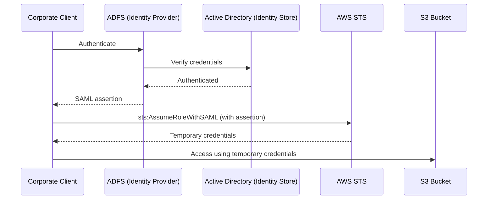

# Identity Federation and IAM Federation with SAML

> Difficulty: Advanced
> Importance: Critical

`CORE` `EXAM FOCUS`

## 1. What Identity Federation Actually Is

`CORE`

**Instructor Concept, exact definition**: "identity federation is a system where we have multiple identity sources and we create a system of trust between them such that authentication and authorization to resources is enabled." Two roles in this system:

- **Identity provider (IdP)** — the source of identity information (where user accounts actually live: on-premises Active Directory, a social provider, etc.).
- **Service provider** — the application or service being accessed (in this course's context, most often AWS itself).

**Deeper Explanation, why federation exists at all**: without it, every service provider would need its own independent copy of every identity — a duplication and synchronization burden at best, and a real security liability at worst (more places a credential can be stored, more places it can leak). Federation lets one authoritative identity source be trusted by many service providers, without duplicating the identity itself.

## 2. Three Federation Options on AWS, at a Glance

`CORE` `EXAM FOCUS`

**Instructor Concept, exact framing of when to use each**:

| Service | Primary Fit | Protocol(s) |
|---|---|---|
| **AWS SSO / IAM Identity Center** | Preferred for most enterprise use cases — multiple AWS accounts and business applications, centralized | Works with many IdPs including Active Directory |
| **IAM Identity Federation** | More legacy today — direct SAML 2.0 or OIDC federation into IAM itself | SAML 2.0, OIDC |
| **Amazon Cognito** | Web and mobile applications specifically | Social IdPs (Apple, Facebook, Google, Amazon), SAML 2.0 |

**Instructor Concept, exact positioning, stated directly**: "think of AWS SSO as being the preferred solution for most enterprise use cases... IAM is where you might have something like ADFS and you're using SAML 2.0 or OIDC, and that's more of a legacy configuration today... Cognito, primarily you're going to be using that with web and mobile applications." This isn't three competing options of equal standing — it's a decision tree based on what's actually being connected.

## 3. How IAM Federation With SAML Actually Works

`CORE` `EXAM FOCUS`

**Instructor Concept, exact end-to-end flow**, using the concrete scenario of a corporate-office client needing access to a secure S3 bucket:

1. The identity itself lives in an **identity store** (e.g., Active Directory, via LDAP).
2. An **identity provider** sits in front of the store — commonly **ADFS** in front of Active Directory — and is what actually performs federation into IAM.
3. The client authenticates to the IdP; the IdP authenticates the user against the underlying identity store.
4. Once authenticated, the IdP issues a **SAML assertion** — a signed document proving the user has been authenticated.
5. The client calls **`sts:AssumeRoleWithSAML`** (a specific variant of the `AssumeRole` family covered in [STS](../01-iam-fundamentals/sts.md)), presenting the SAML assertion.
6. STS validates the assertion and returns **temporary security credentials**.
7. The client uses those credentials to access the S3 bucket — as the assumed role, exactly as in every other STS-based pattern in this course.

**Deeper Explanation, why this is just another variation of the same STS pattern**: `AssumeRoleWithSAML` is not a fundamentally new mechanism — it's the same trust-policy-gated, STS-issued-temporary-credential pattern from [IAM Roles](../04-iam-roles/iam-roles.md), just with a SAML assertion (rather than an AWS account ID, or the `ec2.amazonaws.com` service principal) as the thing the role's trust policy is configured to accept.

## 4. IAM's Identity Provider Configuration

`IMPORTANT`

**Instructor Concept, exact configuration options**: an identity provider is configured in IAM using either **SAML** or **OIDC**. For an on-premises directory source, this typically means a **SAML 2.0-compatible LDAP source** — in practice, usually **AD + ADFS**, exactly as walked through above. **Social identity providers** (for mobile apps particularly) use **OIDC** via a pattern called **Web Identity Federation** — but the instructor explicitly notes: "AWS recommend that you use Amazon Cognito for Web Identity Federation for most use cases" rather than configuring this directly in IAM. See [Amazon Cognito](cognito.md) for that path.

**Instructor Concept, exact attribute-based access detail**: IAM federation supports controlling access based on **federated user attributes** carried in the SAML assertion — e.g., cost center or job role, assigned to the user in the IdP itself. **Deeper Explanation**: this is conceptually the same idea as [ABAC](../02-access-control/rbac-and-abac.md) applied at the point of federation — instead of tagging an IAM user directly, the attribute travels *with* the SAML assertion from the external identity source, letting the identity provider's own attribute data drive AWS-side authorization.

## 5. Common Misconfigurations

`EXAM FOCUS` `IMPORTANT`

- Configuring direct IAM SAML/OIDC federation for a new enterprise deployment when AWS SSO / IAM Identity Center would be the simpler, currently-preferred path for that same use case.
- Configuring IAM Web Identity Federation directly for a mobile app instead of using Cognito, missing the purpose-built sign-in/sign-up tooling Cognito provides on top of the same underlying OIDC mechanism.
- Assuming `AssumeRoleWithSAML` is a fundamentally different mechanism from ordinary role assumption, rather than the same STS pattern with a different trust-policy input.

## Related Topics

- [AWS Security Token Service (STS)](../01-iam-fundamentals/sts.md)
- [IAM Roles](../04-iam-roles/iam-roles.md)
- [IAM Identity Center](iam-identity-center.md)
- [Amazon Cognito](cognito.md)
- [RBAC and ABAC](../02-access-control/rbac-and-abac.md)

## Try This

> Sketch out, on paper or in a diagram tool, the full SAML federation sequence for your own organization's identity source (whatever it actually is) reaching a specific AWS resource — name each of the seven steps in this file's flow with your own real service names substituted in.

## Progress

- [ ] I can define identity provider and service provider, and explain why federation avoids duplicating identities
- [ ] I can name the three AWS federation options and state AWS's guidance on when to use each
- [ ] I can walk through the full SAML-to-STS federation flow, step by step, from memory
- [ ] I can explain why `AssumeRoleWithSAML` is a variation of the same STS pattern covered earlier in this course, not a new mechanism
